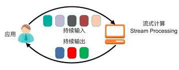
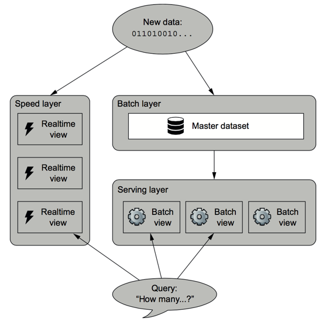
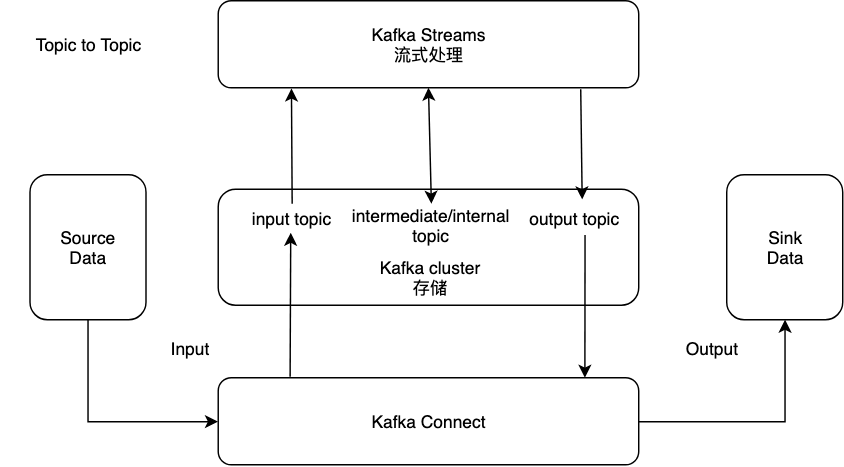
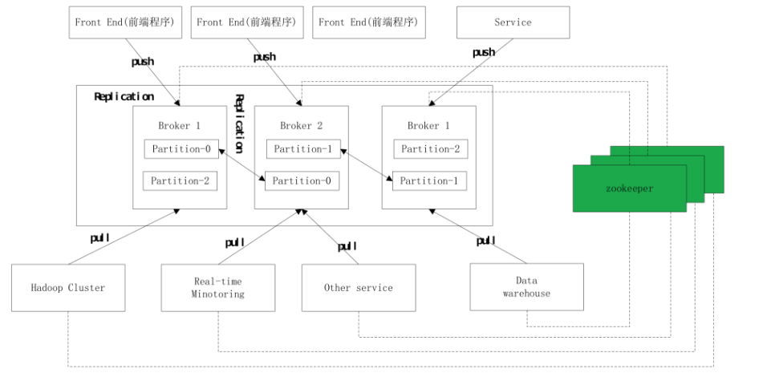

# <a name="streaming_top">流式计算入门教程</a>


### By Gary

---
# Index：
### <a href="#chapter1">1.流式计算</a>
### <a href="#chapter2">2.Kafka Streams</a>
### <a href="#chapter3">3.Spark Streaming</a>

---
# <a name="chapter1">1.流式计算</a>
## 分布式计算
### 不管是网络、内存、还是存储的分布式，最终目的都是为了实现计算的分布式：数据在各个计算机节点上流动，同时各个计算机节点都能以某种方式访问共享数据，最终分布式计算后的输出结果被持久化存储和输出。

## MapReduce计算模型
### 2003年Google对外发布了MapReduce、GFS、BigData三篇论文，MapReduce是一个能处理和生成超大数据集的算法模型，至此并行计算框架正式落地。
### 对于一个Map-Reduce任务，是多级组成的，每一级会起若干的进程，每个进程做的事情就是去读取上一级进程生成的数据，然后处理后让下一级进程进行读取。这个特性使得Map-Reduce有着良好的容错性，当某一级的某一个进程出错了，可以重新调度这个进程到另外一个机器上，重新运行。

## 流式计算（实时计算）和离线计算（批处理）
### 区别：
### 流计算和批处理在对于每条记录的单独处理上基本一致，区别在于聚合类的计算。批处理计算结果的输出依赖于输入数据集合的结束，而流计算的输入数据集通常是无边界的，不可能等待输入结束再输出结果。针对这个问题流处理引入了窗口，简单来说就是将无限的数据流按照时间范围切分为一个个有限的数据集，所以我们依然能够沿用批处理的计算模型。

### 流式计算的本质目的：
- 1.低延迟
- 2.高准确性

### 流式计算和离线计算的分离：
### 流计算是批处理的特例的观点在早期占据了主导的地位，以Spark Streaming为代表的micro-batching类型的实时处理框架的流行为代表。
### 根本问题
### Micro-batching的思想不能完全满足低延迟高准确性的要求。
- 1.低延迟：存在分钟或秒级的执行间隔
- 2.高准确性：无法避免的<b>数据收集延迟</b>会影响结果的准确性，虽然实践经验可以引入额外的安全延迟，但是对于很多对延迟敏感的场景不可接受，实时计算的重算成本较高（需维护状态）

### 为解决以上问题，Storm的作者Nathan Marz提出一个实时大数据处理框架Lambda架构，能够达到大部分要求，主要思想是同时运行实时和离线两个数据处理管道，实时管道提供最近小时内的临时结算结果，而离线管道提供小时以前的计算结果并覆盖掉对应时间段的实时计算结果，查询时将两者的结果再进行合并产生最终的结果：



### 实时计算和离线计算的融合：
### 上面说明了用批处理模型不足以表达流计算，于是人们开始探索批处理是流计算特例的模型。2015年Google发表名为The Dataflow Model的论文，基于批处理是流计算特例的观点提出实时流计算和离线批计算的统一计算模型。

## 流式计算的特性-Window
### 作为对流式数据进行stateful统计的基础，window函数是各流式计算框架必不可少的特性。尽管提供的window API有所差异，但背后的策略都是相似的。在使用window函数的同时，更重要的是考虑如何持续化和恢复计算状态，会不会带来数据丢失或数据重复的潜在问题。

### 基于时间的窗口

### 基于会话的窗口

## 流式计算的特性-Join
### Join操作是数据处理中必不可少的一部分，在分布式环境下，Join是一个全局操作。

---
# <a name="chapter2">2.Kafka Streams</a>
### 它构建在流处理的重要概念之上，比如正确地区分事件时间（event-time）和处理时间（process-time），处理延时数据，高效的应用程序状态管理。

## 拓扑结构
### 拓扑结构是一个有向无环图，是整个Kafka Streams 对数据进行处理的整个过程，如果该处理过程存在循环，会导致数据在处理过程中产生死循环。


## 整体架构


## 并行模型（线程模型）
### 主要由三个部分组成：
- 1.流实例（KafkaStreams）：通常一个机器只运行一个流实例。
- 2.流线程（StreamThread）：一个流实例可以运行多个流线程。
- 3.流任务（StreamTask）：一个流线程可以运行多个流任务，其中流任务的数量是由输入主题的分区数量决定的。（只有一个输入主题的情况，每个流任务只能负责输入主题的一个分区）


### 每个流线程，都有一个与其对应的消费者和生产者，流线程的消费者会从流任务的所负责的主题分区中获取消息，并将消息保存在记录缓冲区中，每个流任务从记录缓冲区中获取消息，并进行处理，并交由流线程的生产者向输出主题中输出信息。其中消费者和生产者会负责流线程中所有的流任务的消息获取和消息发送工作。

## 分区分组
### 分区分组主要就是根据拓扑结构，生成流任务和主题分区之间的对应关系。主要依据拓扑结构中订阅相同的Topic为一组（Consumer Group），Kafka Streams默认的分区分组器，主要通过partitionGroups方法完成:
- 1.遍历拓扑结构中每个组
- 2.找到该组中主题的分区数最大的数量maxNumPartitions（确定流任务数maxNumPartitions）
- 3.通过组号和分区号形成流任务号


### 由于各个topic的分区数量可能是不同的，所以有些流任务(一个分组)订阅了多个主题，可能分不到有些主题的分区：


## 容错机制-Offset&流数据


## 容错机制-流任务再平衡分配
### 如果流线程2出现故障，容错机制会在流线程1中创建一个流任务2，用来处理之前分配给流线程2中流任务2处理的主题分区的数据。


## 流式计算特性Window实现
### KStream&KTable：
### 事件流（KStream）是最基本的数据流模型，每个节点处理完数据会将数据转发给下游节点。变更流（KTable）会根据键记录最新值，会有状态存储，会更新本地存储状态和并将状态变更信息发送到changelog主题中。同时将变更后的信息发送到下游节点。

### State Store：
### 有状态的流任务会将状态信息存储在本地，同时将状态信息发送到kafka集群的内部主题中。备份任务负责将备份的流任务的状态恢复到本地。（只有有状态的流任务才有备份任务）


### State Store容错机制-changelog&checkpoint：
### 为了支持容错、⽀持⽆数据丢失的状态迁移，状态存储可以持续不断的、在后台备份到Kafka主题中，即被称为状态存储的changelog主题，可以启用或禁用状态存储的备份特性。
### 本地状态存储的路径为：状态存储配置/应用程序名称/任务编号/rocksdb/状态存储名称，当流任务关闭时，会在存储目录中生成checkpoint文件，checkpoint文件用于记录本地和变更日志主题中状态的同步位置（offset）。


### KTable可以设置缓存时间和缓存大小，减少写磁盘所带来的延时：
- 当KTable接收到新的消息之后，会判断该变更流是否设置了缓存
- 如果没设置缓存，直接将新的状态保存到本地磁盘，并将变更后的状态发送到下游节点
- 如果设置了缓存，将新接收到的信息保存到缓存中。如果达到了缓存的最大容量，或者达到了设置的刷新时间，则将缓存中的信息保存到本地，并将这些新的状态信息发送到下游节点

### 无状态转换和有状态转换：
- 无状态转换：不依赖于任何状态即可完成转换，不要求流处理器有关联的StateStore
	- 例如：filter、foreach、groupBy、map、WriteAsText...
- 有状态转换：需要依赖某些状态信息
	- 例如：aggregate、windowedBy+aggregate

## 容错机制-备份任务再平衡分配


## 流式计算特性Join实现-JoinWindow
### 连接操作是指将两个流的数据进行连接，使其成为另外一个流的数据源。Kafka Streams要求进行连接操作的两个topic中消息的键的类型是相同的，同时两个topic所拥有的partition的数量相同，向这两个topic发送数据的producer所采用的分区分配策略也是相同的，因为流的连接操作是根据key进行的连接，只有key相同的消息才能进行连接操作，所以需要key的类型相同；此外partition数量相同和使用相同的分区分配策略是为了保证相同key的消息发送到各个topic中相同编号的partition中，这是因为对于具有连接操作的拓扑结构，在对其进行分区分配时，会将这个连接操作的两个流作为一个组，即对于这个组的每个流任务在处理topic1和topic2时只能处理相同编号的分区，这样保证具有相同key的消息会在同一个流任务中进行连接操作。


### 重分区：
### Kafka Streams对数据的处理是基于key进行的，如果修改了key，就可能导致具有相同key的消息在不同流任务中进行处理，这时进行重分区，使用producer发送消息时采用的消息分区分配算法将相同的key重新发送到相同的中间主题（可设置副本因子进行中间主题容错）的相同分区。


### Stream Synchronization问题：
### 当联合两个流时，它们的进度需要被同步。如果它们状态不同步，基于时间窗口的join就会出错。比如一个流的延迟很小，但是另一个流的延迟有一天，在做10分钟的窗口join时就没有意义了。为了处理这种场景，我们要确保每个任务分配的分区组中所有分区的消费速率是同步的。工作线程同步分区组中每个分区的消费进度，是通过消费者的pause/resume API完成的：
- 1.当一个还没暂停的分区比其他分区的时间（这个时间指的是分区的时间）超前定义的阈值，通知对应的消费者暂停
- 2.当一个暂停的分区比其他分区的时间落后定义的阈值，通知对应的消费者不要暂停（即恢复）

## 流式计算数据处理语义
- 1.At-Most-Once
- 2.At-Least-Once
- 3.Exactly-Once：在0.11版本之前，Kafka仅提供At-Least-Once保证，因此任何基于Kafka的流处理系统都不能保证端对端的Exactly-Once。从0.11版本开始，Kafka支持生产者向不同的分区甚至主题进行事务性、幂等性的消息发送，利⽤这一特性，Kafka Streams可以支持Exactly-Once，要启用Exactly-Once，需要配置processing.guarantee=exactly\_once。默认值是at\_least_once。

## 编写生产环境的Kafka Streams Application
### 1.应用重置工具：
### 应用程序重置工具（bin/kafka-streams-application-reset）执行了以下的操作：
- 1.对任何指定的输入主题，重置所有的偏移量到0
- 2.对任何指定的临时主题，跳到所有分区的末尾
- 3.对所有的内部主题
	- 3.1 重置所有的偏移量到0
	- 3.2 删除（内部）主题

### 2.优雅停止（版本迭代）：
```
// add shutdown hook
Runtime.getRuntime().addShutdownHook(new Thread(new Runnable() {
  @Override
  public void run() {
      // Stop the Kafka Streams threads
      streams.close();
  }
}));
```

### 3.意外崩溃报警：
### 在启动应⽤程序之前设置⼀个UncaughtExceptionHandler异常处理器，这个处理器会在⽆论什么时候流处理线程因为⾮预期的异常⽽终结的时候被调⽤。
```
streams.setUncaughtExceptionHandler(new Thread.UncaughtExceptionHandler() {
    public uncaughtException(Thread t, throwable e) {
        // here you should examine the exception and perform an appropriate action!
    }
);
```

### 4.意外崩溃：
### 见上述容错机制-流任务/备份任务再平衡分配内容。

### 5.参数设置（并发度）：
### Kafka Streams最大的并发度取决于partitions数目，因为一旦最大的partitions数目确定了就确定了流任务数，每个Kafka Streams实例配置的流线程数，可理解为是集群公用的线程资源，当线程数设置的足够大（每个流线程都最多只处理一个流任务）那就能达到最大的并发度，但是流线程数设置不够（一个流线程可能同时处理多个流任务）则不能达到最大的并发度。

### 6.系统监控&预警：
### 实时处理监控较为复杂，主要需要关注上游数据（topic）是否正常，通过监控message delay数量或者空数据设置预警；自身系统因框架特殊性，同样需要关注中间主题的存储大小等，以及实时处理产生的聚合结果等数据设置上下阈值进行预警；下游数据可以是回流到Kafka topic或外部DB，如是外部DB还需监控DB健康状态、处理压力等。

### 7.交互式查询（Interactive Queries）：
### 允许进程内部、外部的代码对流处理程序创建的状态存储进行只读的操作。

## 参考：
### 1.<a href="https://kafka.apache.org/23/documentation/streams/">Kafka官方文档</a>
### 2.<a href="http://www.whitewood.me/2019/02/24/%E6%B7%B1%E5%85%A5%E7%90%86%E8%A7%A3%E6%B5%81%E8%AE%A1%E7%AE%97%E4%B8%AD%E7%9A%84-Watermark/">深入理解流计算中的Watermark</a>
### 3.<a href="https://clinat.github.io/2019/07/11/KafkaStreamsTaskRebalance/">Kafka Streams再平衡流任务分配算法</a>

---
# <a name="chapter3">3.Spark Streaming</a>
### <a href="https://github.com/2016gary/Streaming/tree/master/Spark">Spark部分更新中</a>

---
# <a href="#streaming_top">Jump to the top</a>
