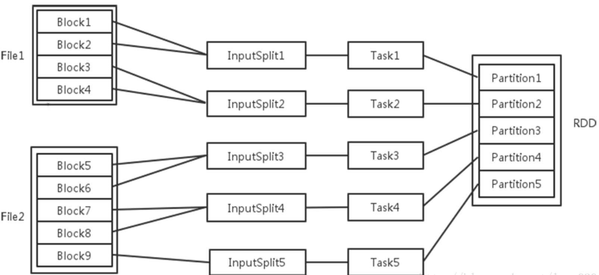
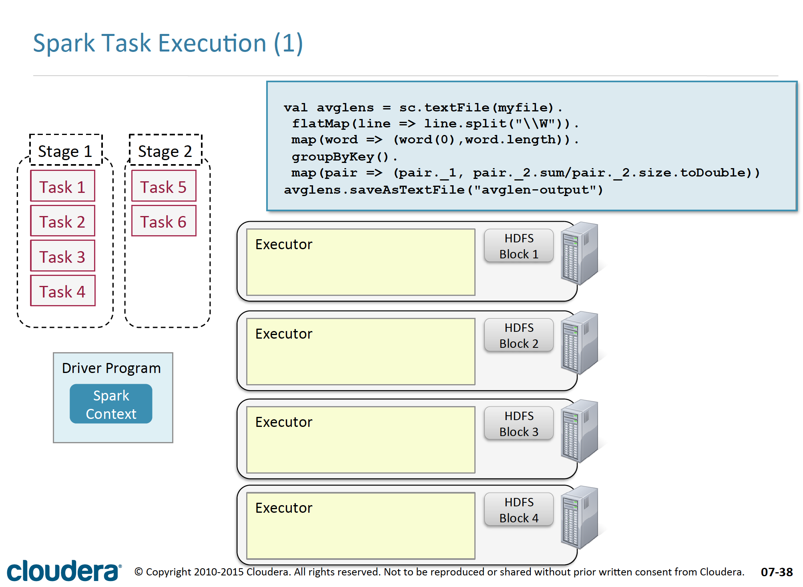
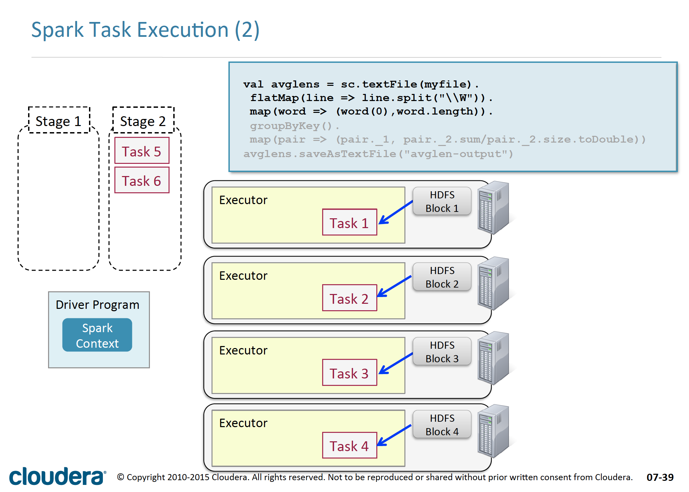
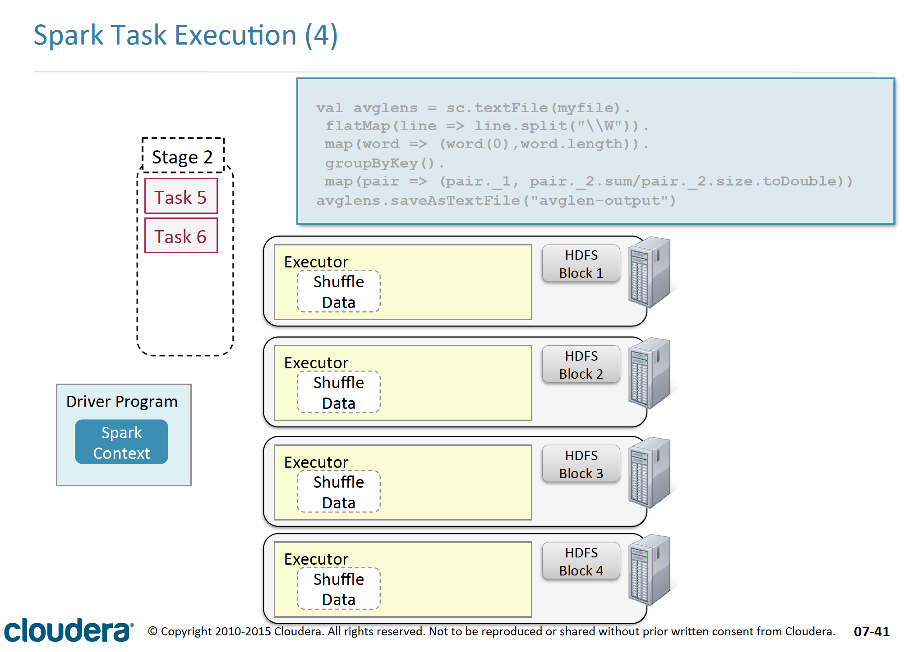
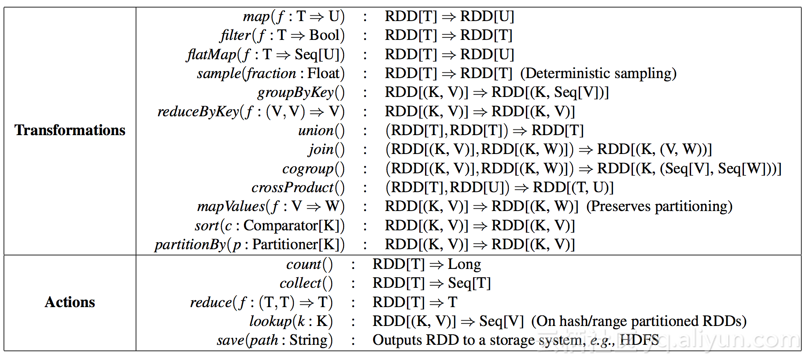

# <a name="spark_top">Spark系列教程</a>

### By Gary
---
# Index：
### <a href="#chapter1">1.Spark概览</a>
### <a href="#chapter2">2.最基础的数据类型：RDD & Partition</a>
### <a href="#chapter3">3.Spark集群架构</a>
### <a href="#chapter4">4.Spark运行模式</a>
### <a href="#chapter5">5.Spark运行流程</a>
### <a href="#chapter4">4.任务 & 资源调度</a>
### <a href="#chapter5">5.内存模型</a>
### <a href="#chapter6">6.算子 & Shuffle优化</a>
### <a href="#chapter7">7.HistoryServer监控</a>
### <a href="#chapter8">8.Spark SQL & DataFrame & Dataset</a>
### <a href="#chapter9">9.Kafka</a>
### <a href="#chapter10">10.Spark Streaming</a>
### <a href="#chapter11">11.调优</a>

---
# <a name="chapter1">1.概览</a>
### Spark是美国加州大学伯克利分校的AMP实验室（主要创始人lester和Matei）开发的通用的大数据处理框架。包括：
- Spark Core：提供Spark最基础与最核心的功能，其它Spark的库都是构建在RDD和Spark Core之上
- Spark Core子框架：Spark SQL、Spark Streaming、MLlib

### Spark应用程序可以使用R语言、Java、Scala和Python进行编写，极少使用R语言编写Spark程序，Java和Scala语言编写的Spark程序的执行效率是相同的，但Java语言写的代码量多，Scala简洁优雅，但可读性不如Java，Python语言编写的Spark程序的执行效率不如Java和Scala。使用时需注意对应版本：

---
# <a name="chapter2">2.RDD & Partition</a>
## RDD
### RDD是Spark提供的最主要的一个抽象概念（Resilient Distributed Dataset），它是一个element的collection，分区化的位于集群的节点中，支持并行处理

## Partition
### 输入可能以多个文件的形式存储在HDFS上，每个File都包含了很多块，称为Block。当Spark读取这些文件作为输入时，会根据具体数据格式对应的InputFormat进行解析，一般是将若干个Block合并成一个输入分片，称为InputSplit，注意InputSplit不能跨越文件。随后将为这些输入分片生成具体的Task，InputSplit与Task是一一对应的关系。随后这些具体的Task每个都会被分配到集群上的某个节点的某个Executor去执行。默认情况下InputSplit与Block是一对一的，而InputSplit又与RDD中的Partition对应

### Partition的数目：
- 数据读入阶段：例如sc.textFile()，输入文件被划分为多少InputSplit就会需要多少初始Task
- Map阶段：Partition数目保持不变
- Reduce阶段：RDD的聚合会触发shuffle操作，聚合后的RDD的Partition数目跟具体操作有关，例如repartition()操作会聚合成指定分区数，还有一些算子是可配置的

---
# <a name="chapter3">3.Spark架构</a>
### Spark架构采用了分布式计算中的Master-Slave模型，整个集群分为Master节点和Worker节点，Master节点上常驻Master守护进程，负责管理全部的Worker节点，Worker节点上常驻Worker守护进程，负责与Master节点通信并管理executors

## 基本概念：
- Application：用户编写的Spark应用程序，包含了一个Driver功能的代码和分布在集群中多个节点上运行的Executor代码
- Client：提交应用的客户端
- Driver：即运行上述Application的main()函数并且创建SparkContext，其中创建SparkContext的目的是为了准备Spark应用程序的运行环境，当Executor运行完毕后，Driver负责将SparkContext关闭
- SparkContext：负责和ClusterManager通信，进行资源的申请、任务的分配和监控等
- DAG Scheduler：根据应用构建基于Stage的DAG，并将stage提交给Task Scheduler
- Task Scheduler：将Task分发给Executor执行
- SparkEnv：线程级别的上下文
- Cluster Manager：集群的资源管理器，在集群上获取资源的外部服务，目前有：
	- Standalone：Spark原生的资源管理，由Master负责资源的分配
	- Hadoop Yarn：由YARN中的ResourceManager负责资源的分配
- Worker：运行作业任务的工作节点
- Executor：每个工作节点上负责具体任务的执行进程
- Task：每个Executor进程具体执行任务的线程

## Job的划分：

---
# <a name="chapter4">4.</a>

---
# <a name="chapter5">5.Spark运行模式</a>
## 3.2 Client
### 提交应用的客户端（有两种提交方式）
- spark-submit --master yarn-client
- spark-submit --master yarn-cluster

### Yarn-client mode：优先运行的是Driver，然后在初始化SparkContext的时候，会作为client端向yarn申请ApplicationMaster资源，当ApplicationMaster运行后，它会向yarn注册自己并申请Executor资源，之后由本地Driver与其通信控制任务运行，而ApplicationMaster则时刻监控Driver的运行情况，如果Driver完成或意外退出，ApplicationMaster会释放资源并注销自己。所以在该模式下，如果运行spark-submit的程序退出了，整个任务也就退出了
### Yarn-cluster mode：本地进程仅仅只是一个client，它会优先向yarn申请ApplicationMaster资源运行ApplicationMaster，在运行ApplicationMaster的时候通过反射启动Driver(应用代码)，在SparkContext初始化成功后，再向yarn注册自己并申请Executor资源，此时Driver与ApplicationMaster运行在同一个container里，是两个不同的线程，当Driver运行完毕，ApplicationMaster会释放资源并注销自己。所以在该模式下，本地进程仅仅是一个client，如果结束了该进程，整个Spark任务也不会退出，因为Driver是在远程运行的
---
# <a name="chapter4">4.Spark运行流程：任务 & 资源调度</a>
### 任务的调度由Driver完成，资源的调度由Cluster Manager完成。Spark on Yarn模式，Driver会和ApplicationMaster通信，资源的申请由ApplicationMaster来完成，而任务的调度和执行则由Driver完成，Driver会直接跟Executor通信，让其执行具体的任务。

- 1.启动Spark集群，其实就是通过运行脚本来启动master节点和worker节点，启动了一个个对应的master进程和worker进程
- 2.worker启动之后，向master进程发送注册信息
- 3.worker向master注册成功之后，会不断向master发送心跳包，监听master节点是否存活
- 4.driver向Spark集群提交作业，向master节点申请资源
- 5.master收到Driver提交的作业请求之后，向worker节点指派任务，其实就是让其启动对应的executor进程
- 6.worker节点收到master节点发来的启动executor进程任务，就启动对应的executor进程，同时向master汇报启动成功，处于可以接收任务的状态
- 7.当executor进程启动成功后，就像Driver进程反向注册，以此来告诉driver，谁可以接收任务，执行spark作业
- 8.driver接收到注册之后，就知道了向谁发送spark作业，这样在spark集群中就有一组独立的executor进程为该driver服务
- 9.SparkContext重要组件运行——DAGScheduler和TaskScheduler，DAGScheduler根据宽依赖将作业划分为若干stage，并为每一个阶段组装一批task组成taskset（task里面就包含了序列化之后的我们编写的spark transformation）;然后将taskset交给TaskScheduler，由其将任务分发给对应的executor
- 10.executor进程接收到driver发送过来的taskset，进行反序列化，然后将这些task封装进一个叫taskrunner的线程中，放到本地线程池中，调度我们的作业的执行

---
# <a name="chapter5">5.算子 & Shuffle优化</a>

### RDD是Spark进行并行运算的基本单位，提供了四种算子：
### 1.创建算子：将原生数据转换成RDD，如parallelize、txtFile等
### 2.转换算子：最主要的算子，是Spark生成DAG图的对象
- 窄依赖算子
- 宽依赖算子

### 3.缓存算子：对于要多次使用的RDD，可以缓冲加快运行速度，对重要数据可以采用多备份缓存
### 4.行动算子：将运算结果RDD转换成原生数据，如count、reduce、collect、saveAsTextFile等

---
# <a name="chapter6">6.内存管理</a>

---
# <a name="chapter6">6.HistoryServer监控</a>

---
# <a name="chapter7">7.Spark SQL & DataFrame & Dataset</a>

## DataFrame
### DataFrame是一种以RDD为基础的分布式数据集，类似于传统数据库中的二维表格。DataFrame的思想来源于Python的pandas库，DataFrame在RDD的基础上加了Schema（描述数据的信息，可以认为是元数据，DataFrame曾经就有个名字叫SchemaRDD）。这使得Spark SQL得以洞察更多的结构信息，从而对藏于DataFrame背后的数据源以及作用于DataFrame之上的变换进行了针对性的优化，最终达到大幅提升运行时效率的目标。反观RDD，由于无从得知所存数据元素的具体内部结构，Spark Core只能在stage层面进行简单、通用的流水线优化。

## Dataset
### Dataset可以认为是DataFrame的一个特例，主要区别是Dataset每一个record存储的是一个强类型值而不是一个Row。

## 区别
### rdd的优点：
- 1.强大，内置很多函数操作，group，map，filter等，方便处理结构化或非结构化数据
- 2.面向对象编程，直接存储的java对象，类型转化也安全

### rdd的缺点：
- 1.由于它基本和hadoop一样万能的，因此没有针对特殊场景的优化，比如对于结构化数据处理相对于sql来比非常麻烦
- 2.默认采用的是java序列号方式，序列化结果比较大，而且数据存储在java堆内存中，导致gc比较频繁

### dataframe的优点：
- 1.结构化数据处理非常方便，支持Avro, CSV, elastic search, and Cassandra等kv数据，也支持HIVE tables, MySQL等传统数据表
- 2.有针对性的优化，由于数据结构元信息spark已经保存，序列化时不需要带上元信息，大大的减少了序列化大小，而且数据保存在堆外内存中，减少了gc次数。
- 3.hive兼容，支持hql，udf等

### dataframe的缺点：
- 1.编译时不能类型转化安全检查，运行时才能确定是否有问题
- 2.对于对象支持不友好，rdd内部数据直接以java对象存储，dataframe内存存储的是row对象而不能是自定义对象

### dataset的优点：
- 1.dataset整合了rdd和dataframe的优点，支持结构化和非结构化数据
- 2.和rdd一样，支持自定义对象存储
- 3.和dataframe一样，支持结构化数据的sql查询
- 4.采用堆外内存存储，gc友好
- 5.类型转化安全，代码友好
- 6.官方建议使用dataset

---
# <a name="chapter8">8.Kafka</a>

---
# <a name="chapter9">9.Spark Streaming</a>

---
# <a name="chapter10">10.调优</a>

---
## 参考：
### 1.<a href="https://blog.csdn.net/bingoxubin/article/details/79076978">徐茂盛《Spark Core介绍以及架构》</a>
### 2.<a href="http://blog.51cto.com/xpleaf/2293921">xpleaf《Spark作业运行架构原理解析》</a>