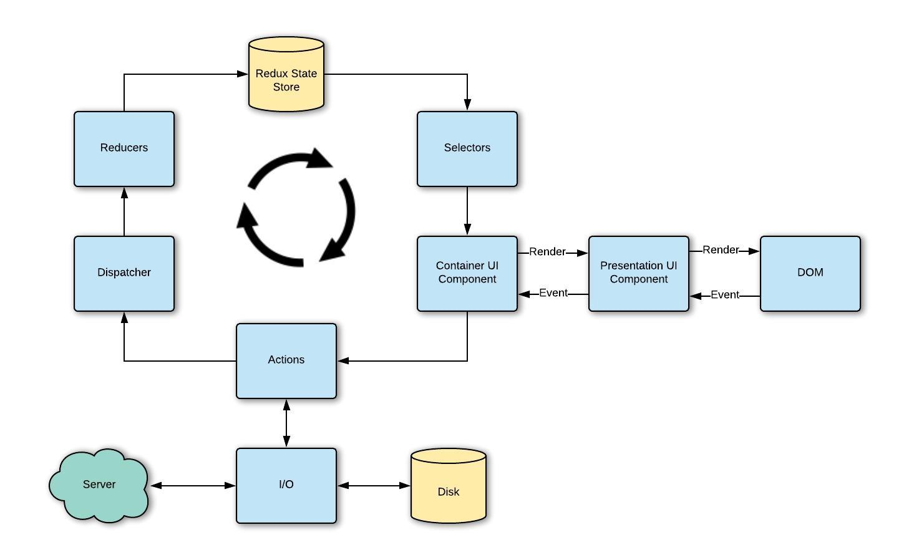
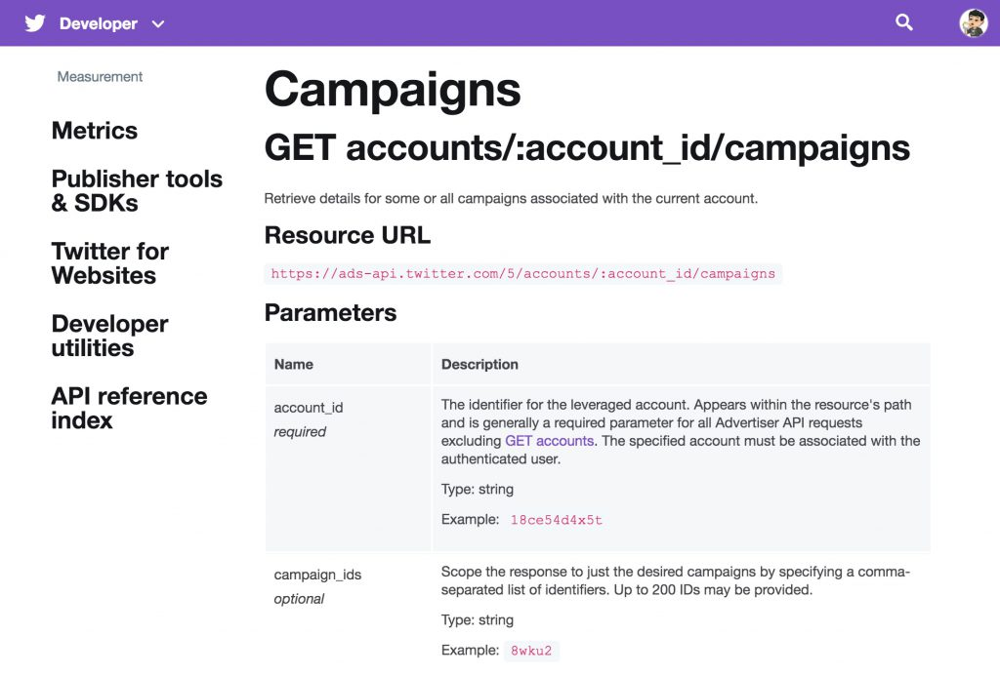
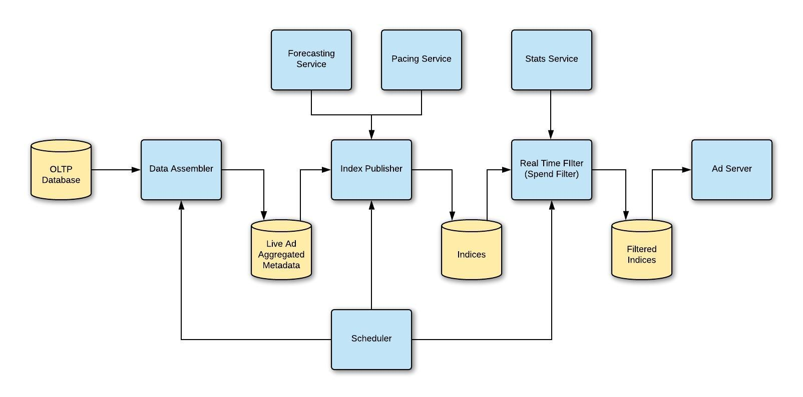
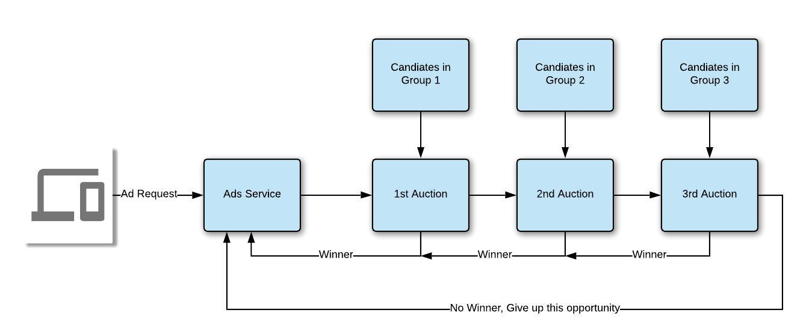
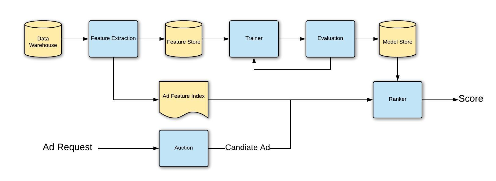

# 广告系统架构：如何构建生产环境的广告系统

### 翻译by Gary
### 原文链接：<a href="https://www.yanjia.li/advertising-system-architecture-how-to-build-a-production-ad-platform/" target="_blank">Advertising System Architecture: How to Build a Production Ad Platform</a>

## 前言
### 数字广告已成为当今许多科技公司最重要的收入来源之一，谷歌、Facebook、Twitter和Snapchat。此外，它可能是21世纪最重要的新业务之一。与传统广告技术不同，数字广告能够更可靠地跟踪观察广告活动的投放效果。因此越来越多的广告商开始在网络广告上投入更多的预算，越来越多的科技公司开始在他们的平台上提供广告投放机会。然而这些广告引擎在幕后是如何运作的呢？如果我们想建立自己的广告系统来在自己的平台上提供广告服务呢？（但对于小型企业或个人开发人员建议使用现有的解决方案，如Google DFP）。现在我将向大家展示这类系统的技术系统设计，也许你会在阅读后得到一些启发。

## 系统总览
### 广告系统与实时交换信息本质上没有什么区别。它在广告商和终端用户之间交换信息。理论上来讲，我们只需要：
- 1.一个广告商可以管理订单的Web界面。
- 2.展示广告的客户端应用程序。
- 3.维护这些订单并过滤出要展示哪个广告的后端系统。

### 由于受约束很少，这种设计对于生产环境下的广告系统远远不够。

### 第一个约束是广告展示的频次。广告商设置目标受众和预算，想展示给尽可能多的受众，然而作为广告平台方，不想因为展示太多广告而损害用户体验。即使总是向用户推荐有用的广告信息，它仍然会分散主服务。

### 第二个约束是广告服务的响应速度。和帖子，图片和视频不同，广告更具动态性。广告活动可以随时达到预算，并可能在任何时候取消。但是为了使广告成为平台的一部分，必须让它速度很快。当广告响应时间比其他服务长时，甚至不得不完全放弃广告展示机会。

### 第三个约束是广告质量。虽然满足前两个约束条件可以使广告引擎顺利运行，但必须在用户最需要的地方提供给用户正确的广告，才能最大限度地提高利润。用户交互越多，赚的钱自然就越多。因此需要最大化这种交互概率。

### 所有这些约束使得一个简单的信息交换问题变得更加复杂。所以这就是为什么还需要构建很多外围组件的原因。例如Ranking服务用来提高广告质量，Pacing服务用来控制广告展示频次。


### 上图显示了一个功能完备的广告系统的总体架构。在像谷歌和Facebook这样的大公司，他们的系统可能有更多的增强功能来满足特定的需求。然而这种架构可以提供一个很好的开端。正如所看到的，广告是广告商和终端用户之间的一个循环，广告系统首先从广告商那里收集广告信息，然后根据投放和预测构建广告索引。利用广告索引和用户个人信息，Ad Server会请求Ranking服务对候选广告集进行打分，并为当前广告请求找到最合适的广告。一旦用户完成了与广告的交互，跳过或点击，系统会收集指标并将其发送回指标收集器。这些收集器背后的Pipeline将事件历史记录聚合为更有价值的实时统计数据和业务日志。反过来，实时统计信息可以帮助Ad Server和Pacing服务更准确地控制投放，而广告库存预测和结算也依赖业务日志，这样广告商就可以建立更多的活动来试验他们的营销策略。

### 接下来，我将深入探讨此广告系统中的每个组件，以讨论更多技术细节。

## 组件
## Web界面
### 就像上面提到的，广告系统本质上是一种信息交换系统。所以首先要有办法将所有信息都输入到这个交换系统中。通常可以设置一个Web界面来帮助广告商管理广告活动。此Web界面通常是单页Javascript应用程序，可以处理复杂的表单输入，大型表和丰富的多媒体内容。只要在Google Ads、Facebook Ads Manager或Snap Ads Manager注册一个帐户，你就可以大概了解这个用户界面的样子。


### 值得庆幸的是，几年前Facebook已经开放了他们的UI框架React.js。通过采用Flux理念和良好的组件封装，我相信它是目前构建广告商Web应用程序最合适的方式。Flux模式解决了交织状态的难题，而JSX使编写可重用的UI组件变得非常容易。此外还可以添加Redux，使状态转换更具可预测性和可维护性。



### 可以将Web界面划分为以下主要区域：
- Home Tables主表：显示所有实体（例如广告活动、广告），也可以进一步编辑。
- Creation Flow创建流程：帮助广告商逐步下订单的向导表单。
- Stats and Reporting统计信息和报表：广告商可以跟踪曝光次数等广告效果，还可以导出报表。
- Asset Library资源库：管理广告商上传的所有多媒体内容的地方，大多时候都有专门的工作室帮助广告商创建，但是也可以提供一些基本的媒体编辑工具来帮助那些没有专业创意服务预算的小型企业。
- Billing and Payment结算和付款：管理付款来源并查看结算信息，这部分通常与Braintree API集成，以支持更多的付款来源。
- Account帐户：管理多个用户的角色层次结构和访问控制，通常大型企业会有多个广告帐户，此外不同角色也会有不同的访问权限。
- Audience Manager目标受众管理：开始时可能不需要，广告商可以定义一些可重用的受众群体，这样就不需要每次都应用复杂的目标受众逻辑。
- Onboarding

### 良好的Web界面，可以让广告商在系统中购买广告的阻碍减到最低。但请记住，Web界面并不是广告系统的唯一入口。接下来看看Ads API（应用程序编程接口）。

## APIs
### 什么是广告API？为什么需要？从上一段可以看出，Web界面需要处理非常复杂的表单，并帮助广告商管理订单。要保留所有这些更改并为UI提供数据，需要一个服务层来执行相应的CRUD操作。但是如果只是这样的功能，不会将其称为API。

### 事实上广告商通常不会把所有的鸡蛋放在一个篮子里。除了使用我们为他们构建的Web界面之外，他们还将咨询一些广告代理商并在那里花费部分预算。这些广告代理商通常拥有自己的软件来跟踪营销活动，并且可以直接访问所有主要的数字广告平台。因此广告API也可供代理商使用，如果我们在此外部Ads API上构建内部解决方案，将能够比API用户更早地发现问题。

### 为了应对第三方代理，通常最好的方法是构建RESTful API，因为它几乎是两个不熟悉通信方的标准通信方式。还有像gRPC和GraphQL这样更好的解决方案，但RESTful可以保证最兼容。此外为RESTful API编写公共文档也更容易。可以参考看看Twitter的API：https：//developer.twitter.com/en/docs/ads/campaign-management/api-reference/campaigns



### 现在已经了解了如何构建API。我想简要介绍一下实现这些API的四大块。

### Campaign Management活动管理
### 简单来说活动管理也就是对所有广告实体的CRUD。但第一，从业务角度来看它需要对所有业务规则进行大量验证。因此像Facade这样的适当设计模式以及使用接口和继承的一致抽象是很重要的。第二，为确保工作流程易于管理，此处还可能使用状态机来维护广告活动或广告的不同状态。第三，许多广告操作是长期运行或异步的。这种类型的异步作业通常由一些PubSub或TaskQueue系统控制，并与状态机集成。第四，数据库应以可扩展的方式支持事务，因为活动管理中的大多数操作可能会影响多张表。

### Access Control访问控制
### 由于这些API最终将由外部用户使用，因此需要在认证和授权上非常小心。典型的cookie会话认证系统是可以接受的，使用token和秘钥加密生成签名更适合于无状态的RESTful API，可以使用第三方OAuth 2.0或自己构建，但是简单的JWT令牌交换可能不够安全，因为涉及到真钱交易。授权也是一个重要部分。在广告系统中，可能有数十种不同的角色，如客户经理、创意经理、客户主管等。创意经理可以上传新的创意，但不允许创建新的活动。允许客户经理创建新的市场活动，但只允许客户主管激活它。幸运的是，广告系统中的大多数实体都属于某种层次结构。帐户属于一个企业；活动属于一个帐户等。因此可以采用责任链模式，并通过层次链跟踪其对某个实体的访问。

### Billing and Payment账单和付款
### 要接受像信用卡这样的公共支付来源，需要向第三方服务机构寻求帮助。BrainTree和Stripe都是领先的企业支付解决方案。此外，来自外部支付来源的另一个担忧是滥用和垃圾邮件的风险。应实施适当的费率限制、异常报警和定期审计，以避免此类风险。

### Metrics and Reporting指标和报表
### 最后但并非最不重要的，Ads API还为广告代理商和Web界面生成报表。根据数据仓库和收集指标的方式，报表的挑战可能会大不相同。因此在设计指标收集的Pipeline时要小心，尤其是对于聚合结果。例如，当统计信息查询中的粒度为WEEKLY时，某些数据可能不可用。但是，对于所有报表服务来说，有一件事是相同的，即QPS通常高于其它服务。可以支持批量统计查询来减少额外的请求，但是人们检查指标的频率要比实际下新订单的频率高得多。

### 在实际的广告API系统中，还有很多模块，例如预算控制、内容审查Pipeline等。还可以结合机器学习模型来进行自动标记，以加快审查过程。但是，你现在应该已经很好地了解从哪里开始。

### Ad Index Publisher广告索引发布
### 广告商现在可以创建一个活动，并在系统中投放他们自己的图像或视频广告。从现在开始，我们将进入系统的用户端。为了确定哪些广告将发送给哪个用户，首先需要知道的是，此时所有参加活动的广告。最简单的方法是查询数据库并按状态字段进行筛选，但是查询通常会花费太长时间，无法满足响应速度要求。数据库表的结构通常便于更新，但不便于读取。例如可以有四个表来记录活动、广告集、广告和广告素材。当想要更新特定实体的一些值时，这很容易。然而当提供广告时，必须查询四个表，来知道一个广告及其所有父项是否都处于活动状态。

### 为了解决这个问题，需要一个索引发布模块预先计算大量有用的索引，并为以后的服务节省时间。它将索引发布到某些存储服务，并且Ad server定期将其加载到内存中。生成实时索引的挑战之一是需要应用各种业务规则，如支出限制和广告调度。此外这些表可能相互关联，需要非常复杂的验证。为了管理这里的依赖关系，可以引入Spark或Dataflow，这通常会导致多级数据的Pipeline：



### 一般来说，需要生成三种类型的索引：
### Live Index实时索引
### 这个索引告诉我们系统中所有实时广告。此外，它还包含Ad server形成广告响应所需的所有必要信息，例如资源位置和广告元数据。除了从id到元数据的主索引，还可以基于目标规则构建一些二级索引。Ad server使用这些二级索引来过滤掉不相关的广告，并仅保留最佳的竞价候选。将在Ad server部分讨论竞价和过滤。

### Pacing Index频次索引
### 需要准备另一个索引是频次状态和系数。故意将其与实时索引分开，因为Pacing通常需要更多的计算，因此希望它是独立的。它还有助于使系统更具弹性，因为仍然可以在出现广告频次控制问题时提供实时广告。

### Feature Index特征索引
### 这个索引包含广告特征，稍后Rank服务将使用这些特征。还可以用一个低延迟的数据存储（如Cassandra）或内存数据库（如Redis）来替换这个索引。

### Pacing频次
### 在开始实际投放广告之前，先考虑这种情况，广告商可能希望在一个月内宣传广告以获得100K展示次数，但是不希望在活动的前几个小时内耗尽所有展示次数，相反希望在活动的整个生命周期内去展示它。此外从最终用户的角度来看，平台方也不希望一次用同一个广告压倒他们，而在另一个时间什么都不展示，这也称为广告疲劳。控制此传送过程的机制称为Pacing。Pacing就像广告系统的北极星;生成的Pacing Index将在以后指导广告投放的方向。

### 最简单的方法是将预算分成一小时或分钟级别的，如果一个广告在当前分钟内耗尽预算，它将从索引发布中过滤掉。然而这种方式对于更精细的粒度控制没有太大的灵活性，仍然会在较短的时间内爆发问题。

### 最传统控制频次的方法之一就是PID控制器。


### 有关PID控制器的详细说明，请参阅维基百科。简而言之，通过分析期望状态和当前状态之间的差异，该控制器可以告诉我们应该给传送系统多少输入。如果节奏是滞后的，这个控制器会告诉我们提供更大的输入，这转化为更高的Pacing系数。而更高的Pacing系数最终将以更高的出价收场，从而击败其他广告商赢得广告机会。

### 需要注意的一个技巧是，有时PID控制器启动速度太慢。此外有时波动可能非常显着。可以在这个公式中引入更多的因子，有了这个Pacing系数，现在可以实施简单的频次服务，以确保广告的顺利投放。还有其他频次技术可以解决某些特定问题，例如还可以为每台Ad server创建一个本地调整因子，以平衡分布式系统中的差异。

## Auction竞价
### 在这一部分，将讨论广告引擎的核心：竞价。竞价是一个买卖商品或服务的过程，通过出价，然后把物品卖给出价最高的人。在基于竞价的广告系统中，不同的广告商参与，出价最高的广告将被展示给用户。

### 当将估算值与广告请求中的传入广告机会信息相结合时，可以确定要为此机会展示哪个广告。在竞价系统中增加Pacing的技巧是使用Pacing系数乘以出价。广告越紧急，Pacing系数越大，从而导致更高的出价。

### 首先需要决定的是使用哪种竞价策略。假设使用最常见的策略 - 第二价格竞价。在实时出价中，第二价格竞价让获胜者有机会比原始提交的报价少一点。中标者不必支付全价，而是支付第二高出价者提供的价格（或加上0.01美元），这称为清算价格。这可能导致所有竞价者被激励以达到真正价值的均衡。虽然广告商为我们提供了最高出价，但还需要考虑其他因素，例如事件发生的概率和投放状态。通过使用如下公式，可以计算出在当前竞价中使用的实际出价。
```
Total Bid = k * EAV + EOV
其中k是Pacing系数，EAV是估计的广告商价值，EOV是估计的有机价值
```

### 广告商价值是广告商通过展示此广告可获得的实际回报。不同的广告目标可能有不同的方式来计算EAV。如果想优化点击，那么：
```
EAV_click = b_click * p_click
其中b_click是获得点击的最高出价，p_click是获得点击的概率
```

### 有机价值是平台或用户体验的好处。要计算广告商的价值，最简单的方法是将事件的概率乘以此类事件的最高出价。例如，如果我们发布这个广告，点击一个广告的概率是0.1，并且广告商愿意为点击支付1美元，那么这里的平均值将是0.1*1=0.1。计算有机值，不同平台的公式是不同的。例如，跳过广告可能意味着糟糕的用户体验，可以指定一个负权重进行惩罚。
```
EOV = p_click * w_click + p_finish * w_finish + ... - p_skip * w_skip
式中p_event是此类事件的概率，w_event是此事件对最终值贡献的权重。
```

### 在更复杂的竞价系统中，可以设计更多公式以反映基于不同业务优先级的实际竞价价格。请记住使用的数学算法决定了广告引擎的风格。

### 请注意此出价仅适用于竞价。由于在这里采用第二价格竞价，广告商只需要支付第二高价出价者提供的价格。另外如果想惩罚糟糕的用户体验广告，也可以这样做：
`price = Total Bid(second highest bidder) - EOV(winner)`

### 这样一来，如果赢家的广告对用户有很大的价值，价格就会下降，其ROI投资回报率也会上升，反之亦然。

### 目前为止讨论了比较不同竞价时使用的策略，以及如何计算实际竞价价格。最后一个难题是连接所有这些的实际竞价引擎。当一个请求进入竞价引擎时，首先对所有候选广告进行排序，然后找到当前广告展示机会的最高出价者。有时有一些商业理由将候选人分为几个优先组。竞价引擎像瀑布一样，机会请求落在每个优先级组中，并且仅在组内进行竞价。只有在没有找到合适的候选广告时，请求才会转到下一组。还有需要提醒投放广告也有成本（网络带宽，计算资源等），因此也可以设定最低竞价价格，以筛选出那些竞价价格可忽略的候选广告。



### 但是这里有一个约束，一次只竞价一个项目（如一个广告位）。在某些情况下，需要能够将多个项目一起拍卖，因为它们是相关的。在这种情况下，可以实施广义的第二价格竞价。广义的第二价格竞价（GSP）是针对多个项目的非真实竞价机制。每个竞价者都会出价。最高出价者获得第一个位置，第二高位，第二个位置，依此类推，但最高出价者支付第二高出价者的出价，第二高出价者以第三高出价支付出价，以及等等。

## Ranking
### 一般来说，一个广告Ranking系统试图解决的问题是这样的：给一个为用户挑选广告的机会，通过用户过去的行为、用户的兴趣和广告历史表现来提供最好的广告，从而最大限度地提高广告主的ROI投资回报率。那么它是如何工作的呢？还记得计算每个广告的实际出价的公式吗？不仅需要广告最高出价，还需要事件的概率和有机价值的权重。在最简单的广告服务器版本中，Ranking可以返回硬编码分数。竞价引擎将遍历所有候选广告并快速计算EOV和EAV。但是如果将Ranking扩展到一个单独的服务中，可以加入更多的技术，比如机器学习，以提高性能和利润。



### 要构建这样的机器学习Pipeline，首先需要进行数据清理和聚合。此步骤也称为特征工程，可从用户和广告指标中提取有用信息。常见特征包括但不限于：
- 上下文特征：时间，位置，设备，会话等
- 人口特征：性别，年龄，国籍，语言等
- 参与特征：查看次数，点击次数等
- 广告特征：活动ID，品牌ID，帐号ID等
- 疲劳特征：用户看过此广告，品牌等的次数
- 内容特征：类别，标签，对象检测等

### 使用Dataflow/Spark/Flint可以批量转换这些特征并将它们放入特征存储中。下一步是使用这些特征训练模型。与计算机视觉或NLP不同，广告中的机器学习技术通常更直接且更成熟，例如稀疏逻辑回归Sparse Logistic Regression和梯度提升决策树Gradient Boosting Decision Tree。可以使用TensorFlow，XGBoost或scikit-learn构建通用训练。为了运行实验，将不同的配置protobuf提供给训练。

### 当完成训练并通过所有验证和评估后，它会将模型文件发布到某个远程存储库，并通知Ranking获取这个新模型。通常新模型仅部署到生产中的一小部分以验证性能。

### 由于某些特征输入来自实时数据，因此还需要构建实时特征索引。正如之前所讨论的，该索引是由广告索引发布模块准备的。然后Ranking会在运行时从这个索引中查找诸如广告统计、用户参与指标等，并进行预测。

### 在生产机器学习Pipeline中，中央调度系统协调所有任务。系统维护作业信息，跟踪每个任务的状态，并帮助管理工作流的DAG。不难从头开始编写这个服务，但是在Airflow或Kubeflow中使用容器操作也是一个不错的选择。

## Forecasting预测
### 尽管对于广告系统的最低可行版本不是必需的，但是库存预测在许多方面都是有用的。它可以让销售团队或Web界面了解未来可以预订多少库存。它还可以通过提供实际和预测的结果来改善Pacing系统，从而在充足的时间内提供更多的曝光，并在流量不足时收紧。此外还可以用于新的特征测试和调试。

### 一个简单的实现是通过回顾历史数据来计算未来库存（例如曝光），然后将它们分类到不同的桶中。然后获取新的广告（或活动），找到它的存储桶并累积库存。但是缺点是需要单独维护这些类别，而不是生产服务逻辑，这些逻辑不是完全可扩展的。

### 更强大的解决方案是从生产服务路径中提取逻辑并对其进行模拟。通过模拟拿新的广告，假装是一个实时广告，并提供历史曝光，并试图预测。由于使用和生产广告服务器相同的逻辑，因此更准确地反映了未来的行为。

### 但是如果流量很大，则完全模拟可能需要很长时间才能运行。如果这样需要一些技术来提高性能。一般来说，有几种方法：
- 下采样历史请求：例如，每个用户只取所有曝光的1/10。需要用户抽样的原因是，当有更多展示次数时，频次上限会影响投放。
- 关闭一些服务器功能：在模拟中不需要广告服务器上的某些功能。如果可以关闭一些不重要的，比如使用固定权重而不是查询Ranking服务，那么每次模拟竞价的运行时间将会减少。
- 单独分配现有广告的库存：当预测新广告的库存时，可以重新使用最近预测任务中其他现有广告的库存分配。此外可以用一个单独的工作来准备现有广告的分配。
- 并行模拟：现在已经为现有广告分配了广告位，只需要同时处理一个新广告。因此不会受到其他广告的干扰，可以并行模拟多台机器的交付。


### 这个模拟设计可以帮助了解一个新广告有多少库存，让我们看看模拟的其他好处。首先，从模拟运行生成的事件也可以用作事件估计。可以预测从这个广告中可以得到多少点击或应用程序安装。其次可以进一步开发Pacing系统。有时广告商希望预订广告资源以保证达到X用户Y次。如果广告预订了100K展示次数，将从未来的模拟中获取这些100K展示次数，以确保不会超额预订。

## Targeting
### 虽然机器学习可以帮助找到广告和用户之间潜在的良好匹配，但广告商通常对广告的投放位置有自己的看法。有时候定位受众群体对于像可口可乐这样的广告商来说会非常广泛。有时范围将是一个小的利基市场，如某些邮政编码或某些爱好。因此需要对这些目标规则进行结构定义。一个令人困惑的部分是AND/OR逻辑，以及每个目标规则之间的INCLUDE/EXCLUDE。
```
{
    "demographics": [
        {
            "occupation": ["teacher"]
        },
    ],
    "geolocations": [
        {
            "country": ["us"]
        }
    ]
}
```

### 虽然这种结构很容易被阅读和交互，但广告服务器确定给定的目标规范是否有目标匹配并不完全如此。解决这个问题的一个简单方法是将这个嵌套的json blob展平为这样，这样就可以遍历列表来查找过滤候选广告是否匹配。
```
[
    {
        "operation": "equals",
        "value": "us",
        "key": "country",
        "group": "geolocations"
    },
    {
        "operation": "equals",
        "value": "teacher",
        "key": "occupation",
        "group": "demographics"
    },
]
```

### 解决此问题的另一种方法是布尔表达式匹配算法。在高吞吐量低延迟PubSub系统的设计中首先出现了对快速布尔表达式匹配的需求。后来研究人员意识到电子商务和数字广告都面临同样的问题。一些标准算法是K-Index，Interval Matching和BE-Tree。

### 通过上面的目标规范，现在可以了解谁是给定广告的目标受众了。但是仍然需要将其与最终用户关联起来。要建立此连接，需要在广告与广告机会匹配时使用用户个人信息。用户个人信息是根据所有类型的历史用户数据（如购买历史记录和浏览历史记录）编译的。（是的，这也是为什么Facebook在隐私方面如此臭名昭著，他们从你的数据中获利，但不会告诉你）。目标受众Pipeline可以从历史中预测出用户的兴趣和人口统计。如果没有足够的数据来描述最终用户进行这种连接，那么还可以与一些第三方数据公司集成，以获得更多的信息。

## Ad Server广告服务器
### 目前为止已经介绍了将广告从广告商到最终用户所需的几乎所有组件。把这些放在一起，就可以构建最终的广告服务器了。广告服务器为客户端（Web或移动端）公开一些服务接口，运行竞价，调用Ranking服务，获取用户个人信息，并使用索引。为了更详细地解释这一点，让我们看看当一个新的广告请求出现时会发生什么。

### 请求剖析
- 1.当客户端启动时，它首先会与广告服务器通信，并告诉我们现在有一个新的活跃用户在线。这样做的原因是它让我们有时间将用户个人信息加载到某个内存数据库或BigTable中，以便以后更快地查找。同时初始化响应还可以指导客户端进一步的操作。
- 2.接下来，当客户端意识到需要尽快展示广告时，它会向广告服务器发送广告请求，并询问广告内容的加载位置。如果广告只是文字，可以将元数据与广告响应一起返回。如果广告是静态文件，则应返回CDN位置。负载均衡器会将请求路由到任何健康的节点/pod，因为它们都包含最新的广告索引。
- 3.根据请求中包含的上下文信息以及实时广告索引，可以过滤掉那些首先没有定位匹配的广告。然后在将广告候选发送到竞价中之前，还可以应用一些其他过滤器，如频次上限或预算上限。
- 4.竞价结束后，广告服务器会在指标表中记录获胜者（如果没有获胜者则为空）。在此期间，广告服务器还将获胜者信息发送回客户端，以便它可以开始准备广告。
- 5.广告展示后，客户端会将跟踪事件发送回指标收集器。

### 可靠性
### 与上面讨论的其他模块不同，广告服务器位于广告业务的最前沿。广告服务器中的一个小问题可能意味着广告投放立即失败，这实质上是收入损失。因此，可靠性是这里最重要的属性。在非核心模块发生故障的情况下，需要rollback一些备份计划。例如如果Ranking系统无法响应，广告服务器需要具有默认模型来估算广告价值。在整个系统出现故障的情况下，快速回滚和重新部署至关重要。对于广告服务器来说，这通常不是一件容易的事，因为内存初始化很多。在优化初始化代码路径的同时，还可以采用canary部署策略或者使用一些热备份服务器。

### 延迟
### 要以闪电般的速度提供广告请求，诀窍是将索引加载到内存中。但是内存大小通常有限制。这种限制的原因是多种多样的，它可能来自云提供商或拥有的物理机器。这也可能是因为业务方面的成本效率要求。如果索引的增长大于每台机器设置的最大内存大小，需要开始将索引拆分为组。一种选择是按区域拆分索引。来自欧洲的广告请求仅到达欧洲集群，该集群仅保留所有欧洲广告的索引。这种方法在开始时看起来更自然，但它也对整个广告工作流程施加了硬区域约束。另一种方法是让调度程序同时查询多台机器。同一组中的每台计算机都有不同的索引分片。

## Metrics指标
### 即使成功地向最终用户投放广告，也不是旅程的终点​​。这个难题的最后一个重要部分是指标和统计服务。通常这些统计服务有两种类型的工作负载。一方面，业务分析师需要提取大量历史数据查找编制活动报表以及生成发票和账单，另一方面，广告商对当前正在运行的广告的实时性能非常感兴趣。

### 这两个不同的目标还需要不同的基础设施，以确保最高的效率。对于业务分析，通常将所有原始数据存储到OLAP数据库或BigQuery等云分析软件中。然后工具和数据工程团队可以从那里开始构建更多Pipeline。对于实时统计数据，经常将数据存储到某个时间序列数据库中。可以使用OpenTSDB，InfluxDB或Graphite等现有解决方案，也可以在BigTable等可扩展数据库之上构建TSDB查询引擎。虽然不同的解决方案有不同的侧重点，但这里主要关注的是数据的粒度和保留期。小粒度和低延迟是此类实时统计数据的关键。

### 然而将指标存储在不同的位置并不意味着需要构建两个不同的数据Pipeline。典型的设计是将通用指标收集器作为前端，以接收来自客户端或其他服务的所有指标和日志记录。然后像Kafka或PubSub这样的消息队列系统会将所有这些事件传输到某些流数据处理应用程序，例如Spark或Dataflow。Spark应用程序将这些原始事件转换并聚合为所需的格式，然后输出到不同的数据仓库以实现持久化。在我们的情况下，我们最终将数据路由到TSDB和OLAP DB。


### 请记住在这种数据Pipeline中，一个糟糕的设计或差异将导致许多严重的问题或对其下游消费者的限制。虽然在最初的设计中无法想象未来的所有需求，但仍然应该确保灵活性，以便将来可以轻松地扩展它。例如一些统计汇总任务需要跨越数天或数周的数据，或者来自数据转换输出的不同阶段的数据。

## 总结
### 恭喜！你现在已准备好开始构建自己的广告平台了！记住，这里的设计布局只是旅程的开始。在现实世界中，很难忽略所有遗留问题，从头开始构建新的平台。通常由于现有的技术栈业务需求，需要进行一些权衡并添加一些冗余。此外构建上述所有内容将是一个庞大的项目，通常需要数十名工程师。它不仅涉及软件本身，还需要强大的基础架构和工具来确保有效的部署，扩展和资源规划。

### 话虽这么说，如果不能很快雇用数百或数十名工程师，仍然可以先在系统的一部分上工作。一些初创企业专注于活动管理，这只需要一个优秀的Web界面和API。其他人可以关注广告Ranking，并使用机器学习来最大化ROI投资回报率。


